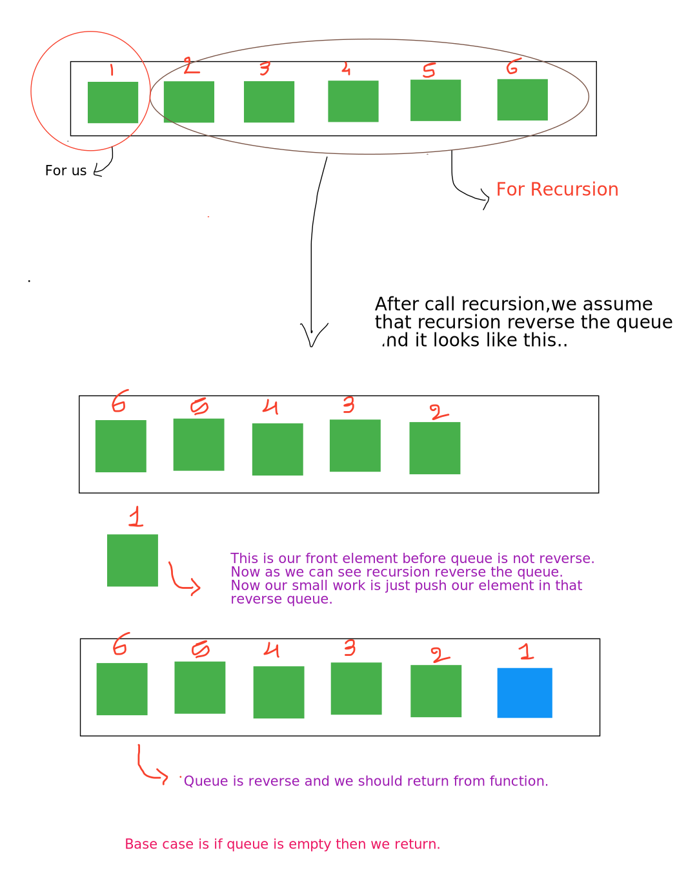

## Reverse Queue
Given a queue of integers, reverse it without help of any explicit stack or queue. You need to change in the given queue itself. 
Note : No need to return or print the queue. 
### Input format :
Line 1 : First Element - Size of Queue, Rest Elements - Elements Of Queue
### Output format :
Queue elements
### Sample Input :
4 1 2 3 4     (1 is at front)
### Sample Output :
4 3 2 1    (4 is at front)

### Solution 1

